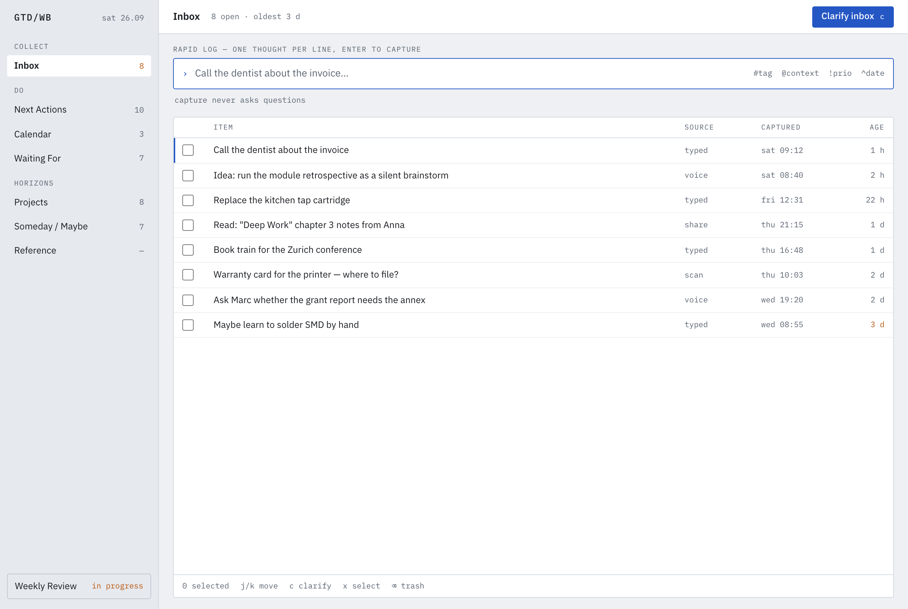
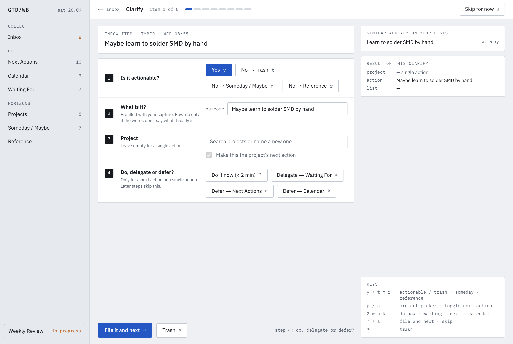
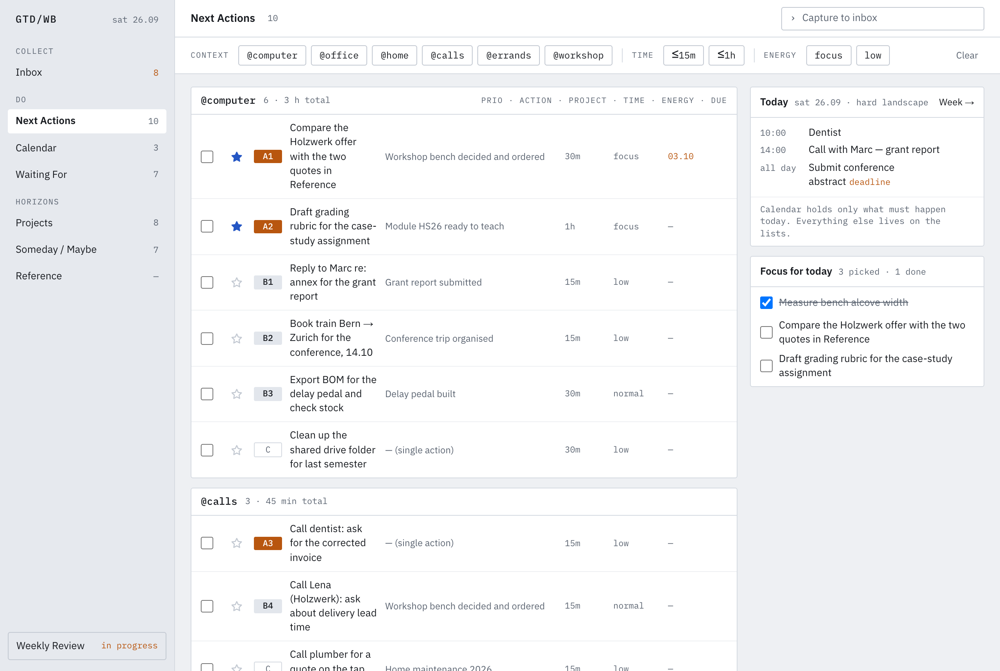
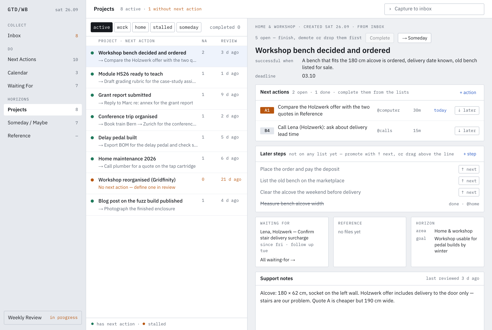
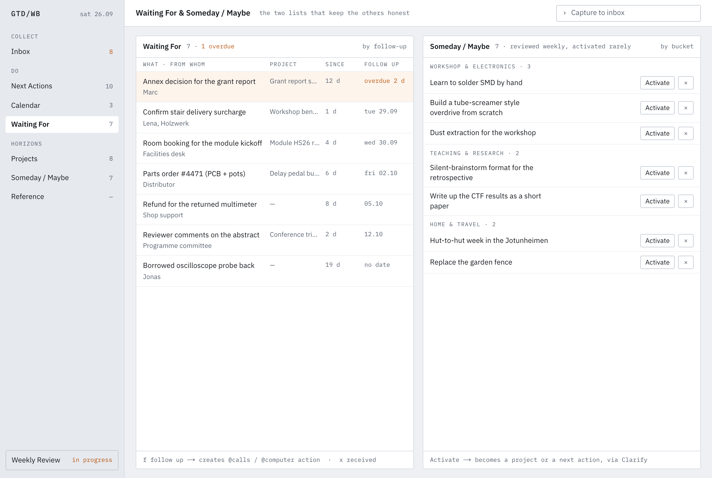
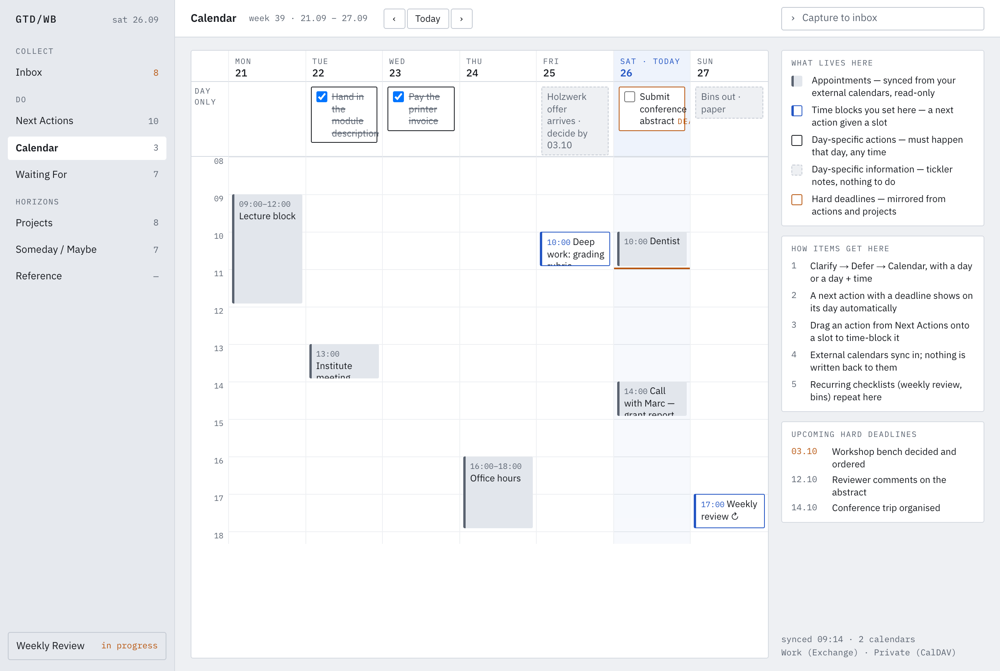
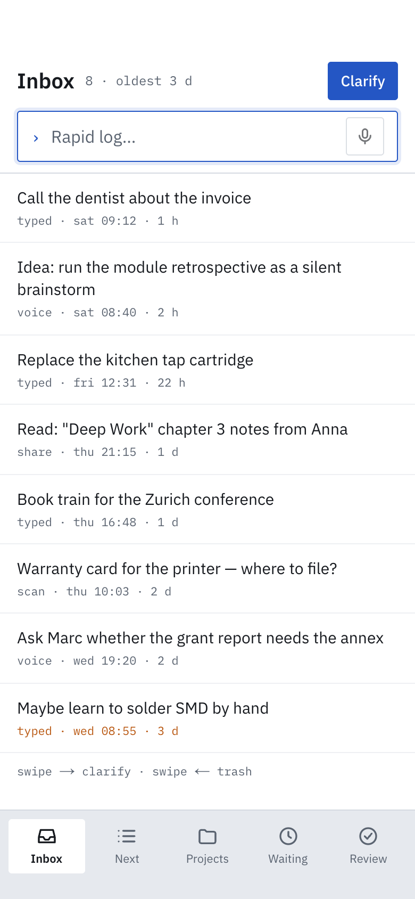
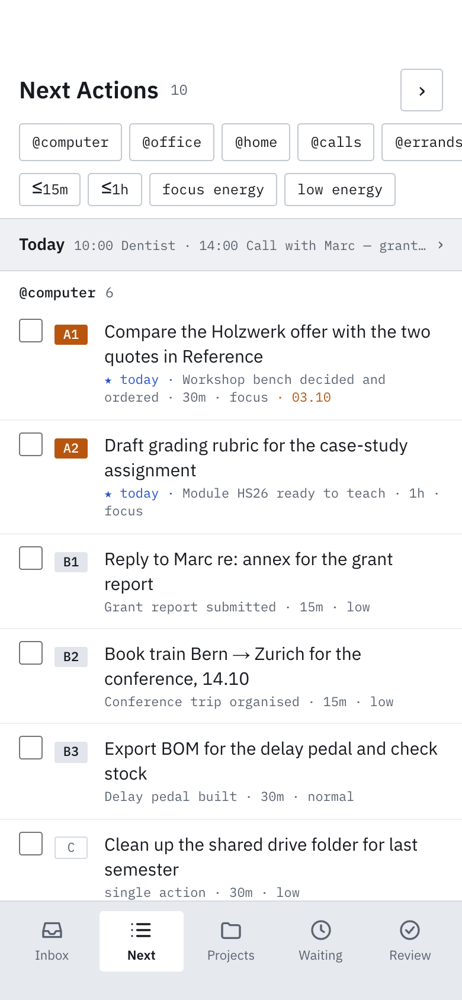
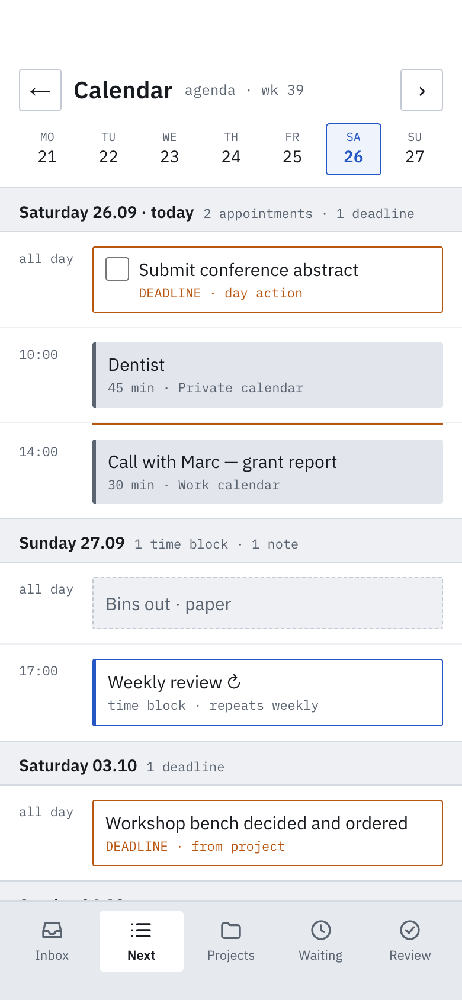
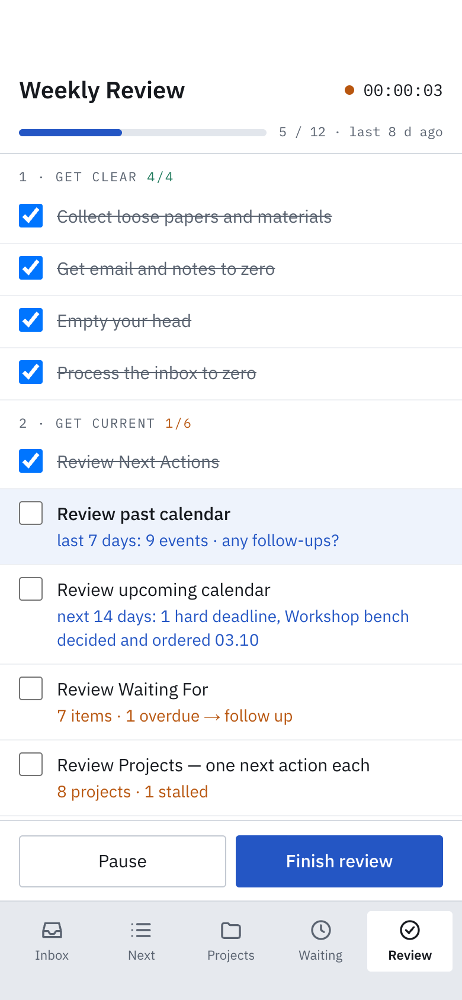

## In short

Two doubts come up whenever AI is suggested for personal time management:

1. **"AI wastes time."** You spend hours prompting and fixing, and in the end nothing
   usable comes out.
2. **"I lose control."** Once an AI is involved, you no longer know what happens to your
   tasks, and the tool starts deciding for you.

This report answers both with one concrete case: a complete *Getting Things Done* (GTD)
application — seven screens on desktop and phone, the full GTD workflow, a database,
222 automated tests — built by an AI coding agent in **about three hours of active
work**. The logs that show this are summarised in @sec-effort.

The second doubt is answered by the architecture (@sec-control): the AI is **not inside
the tool**. The tool is plain, transparent and fully usable by hand. An AI agent is an
*outside user* of the same interface the human uses, with its own, narrower
permissions. Every decision in the GTD process stays a human decision, and every change
is visible on the same lists the human works with.

::: {.callout-note}
## Numbers at a glance

| | |
|---|---|
| Active working time, build (steps 00–09) | **≈ 3 h** (2 h 37 – 3 h 29, depending on the idle cutoff) |
| Elapsed time for the build | one afternoon and evening (5 h 42 wall clock) |
| Human messages to the agent during the build | 19, most of them the next step prompt pasted from the brief |
| Screens | 7, each for desktop and phone |
| Application code | ≈ 8 400 lines of TypeScript |
| Automated tests | 111, each run against two storage back-ends (222) |
| Accessibility (Lighthouse, mobile) | 100 / 100 on the two most used screens |
:::

## Getting Things Done in one page

GTD (David Allen) is a method, not a tool. It rests on five habits:

| Habit | Question | In the app |
|---|---|---|
| **Capture** | What has my attention? | Inbox with a rapid log: one line per thought, nothing else asked |
| **Clarify** | What is it, and what is the next action? | Clarify: the same four questions for every item |
| **Organise** | Where does it belong? | Next Actions by context, Projects, Waiting For, Someday / Maybe, Calendar |
| **Reflect** | Are my lists still true? | Weekly Review: a checklist with timer and measured results |
| **Engage** | What do I do now? | Next Actions filtered by context, time and energy; a "Today" focus |

The app follows the textbook closely and adds nothing that competes with the method: no
priorities invented by software, no automatic scheduling, no "smart" suggestions.

## What the app does

### Capture: the inbox

{#fig-inbox}

Capturing must be faster than forgetting. The rapid log accepts a line and returns
immediately — it **never asks a question**. Optional shorthand (`@calls`, `!A`, `^fri`,
`#tag`) is understood if present and ignored if not.

### Clarify: four questions, always in the same order

{#fig-clarify}

Every item goes through the same four decisions, all visible at once (no wizard that
hides the next step). Before the item is filed, a summary shows exactly what will be
created. Nothing leaves the inbox without a human answer to these questions.

### Organise: the lists

{#fig-next}

{#fig-projects}

{#fig-waiting}

{#fig-calendar}

### Reflect: the weekly review

{#fig-review}

The review is where GTD usually fails in practice. The app makes it concrete: twelve
steps in three phases, each linking to the list it concerns, with live figures
("7 items · 1 overdue → follow up"). When a step is ticked, the app writes down what
actually changed while the step was open.

### On the phone

::: {layout-ncol=4}







:::

The phone is for capturing, ticking and reading; planning stays on the desktop. Swipe
gestures are shortcuts only — every action is also reachable by a plain tap.

## How the human stays in control {#sec-control}

### The tool itself contains no AI

The specification lists "AI features of any kind" explicitly as a *non-goal*. The app is
deterministic: the same input always gives the same lists. Concretely:

- **One control per decision.** Every state (done, focus for today, next vs. later,
  context, deadline …) is set on exactly one screen and only *shown* elsewhere. There is
  never a second, hidden place where something changes.
- **Nothing is fixed behind your back.** A project without a next action is marked
  orange; the app does not invent one. An overdue waiting-for is tinted; the app does not
  send a reminder.
- **Everything can be undone.** Done, trash, received, drop: five seconds to undo, and
  trash is only emptied when *you* finish a weekly review.
- **Everything is visible.** There is no background process that moves items; every
  item is on exactly one list you can open.

### The AI is a user of the tool, not a part of it

The design principle behind this app (and behind other tools built the same way) is:

> **No AI in the tool. AI as a user — with its own rights and permissions — on the same
> interface as the human.**

```{mermaid}
%%| fig-cap: "One interface, two kinds of users. The agent gets its own, narrower permissions. Solid: built. Dashed: planned."
flowchart LR
  H["Human<br/>(browser, phone)"] --> UI["Screens"]
  A["AI agent<br/>(assistant, scripts, mail)"] -.->|"token + permissions"| EXT["External access<br/>(HTTP / MCP)"]
  UI --> ACT["Server actions"]
  EXT -.-> ACT
  ACT --> API["One typed interface<br/>capture · clarify · complete · follow up · review …"]
  API --> DB[("Your data<br/>(SQLite file)")]
```

Every operation — capturing, clarifying, completing, following up, reviewing — exists
exactly once, in one typed interface (88 operations). The screens use it through
38 server actions. An AI agent would use the **same** operations, through an
authenticated entry point, with **fewer** rights than the human.

::: {.callout-important}
## What exists today and what is planned

**Built:** the single typed interface and the server actions all screens go through;
the rule that nothing writes to the data except through them; the transparent lists.

**Planned** (the next prompts in the repository): an authenticated capture endpoint for
scripts, mail and an assistant (step 16); a keyboard command palette on the same
operations (step 13); external calendars, read-only (step 12). A broader agent
interface with per-operation permissions follows the same pattern.
:::

### What an agent does — and what it does not

The permission model follows GTD's own division of labour: *collecting* and *reminding*
can be delegated, *deciding* cannot.

| An agent may … | … through | The human still … |
|---|---|---|
| put things into the inbox (from mail, chat, a voice note) | `capture` | clarifies every item |
| read the lists and prepare the weekly review ("3 stalled projects, 1 overdue follow-up") | read-only operations | ticks each step, decides what changes |
| draft the follow-up mail for an overdue waiting-for | read + a draft outside the app | sends it, or not; `follow up` is one key |
| warn about an overloaded day | calendar read | moves or keeps the appointments |
| — | `clarify`, `complete`, `demote`, `drop` | **keeps these for himself or herself** |

Because the agent writes through the same interface, everything it does is visible in the
same place: a captured item appears in the inbox with its source, like any other.
Nothing lands anywhere the human does not look anyway.

## How it was built {#sec-effort}

### The process

1. **A brief first.** A product specification (the GTD rules as decisions), 14 static
   screen mockups and a series of step-by-step prompts, each with a "definition of done".
2. **One step per prompt.** The agent (Claude Code) implements a step, runs the checks
   (lint, types, tests, build), shows the result in a browser, and commits it.
3. **The human reviews and decides.** When the specification and a mockup disagreed, or
   a rule was not covered, the agent asked instead of inventing. Corrections were short:
   "a time block stars an action only when it is today", "remove that module code from
   the demo data".

### The evidence

The agent's session logs record a timestamp for every message, tool call and result.
Merging all sessions (two ran in parallel) and cutting the timeline wherever nothing
happened for longer than a threshold gives the active working time:

| Idle cutoff | Build, steps 00–09 | Afterwards: publishing, clean-up, this report |
|---|---|---|
| 5 min | 2 h 37 | 0 h 20 |
| **10 min** | **3 h 06** | **0 h 40** |
| 15 min | 3 h 29 | 0 h 50 |

The build took one afternoon and evening on the clock (15:53–21:35), but the working
blocks in between add up to about three hours. The script that computes this is in the
repository (`docs/report/effort.py`); the logs themselves are not published, because
they contain the full conversation.

| Working block | What was done |
|---|---|
| 15:53 – 16:42 | Project set-up; scaffold; inbox; clarify (two sessions in parallel) |
| 16:54 – 17:30 | Decisions on inbox and clarify; next actions |
| 18:09 – 18:49 | Follow-ups; projects; waiting for and someday / maybe |
| 19:09 – 19:18 | Checks |
| 19:29 – 20:15 | Calendar; weekly review; phone layouts |
| 21:28 – 21:35 | Database (persistence) |

### What is *not* in these three hours

To be fair to the sceptics: the **brief** — specification, mockups and prompts — was
prepared beforehand, in a separate design session, and is not part of the measured time.
The agent is fast *because* the brief is precise. Writing down what you want is still
your job; it is also exactly the part of the work that keeps you in charge.

### Mistakes — and who caught them

The agent is not flawless, and the process does not assume it is:

- A time-zone bug in how timestamps were sorted was caught by the automated tests.
- A slip in how two changes were split into commits was noticed and repaired by the
  agent during a later check.
- The agent had made the demo data *too* realistic, reusing a real course code and a
  real-sounding company name. The **human** spotted it; the agent removed it from the
  entire history.

This is the human-in-the-loop at work during development, too: the agent does the
volume, the human sets direction and checks the result.

## Conclusion

- **Time:** a full, tested GTD application in about three hours of active work — an
  afternoon, not weeks. The precondition is a clear brief.
- **Control:** the tool contains no AI and makes every GTD decision a human one. An AI
  agent helps from *outside*, as a user with limited rights on the same interface —
  collecting, preparing, reminding — while clarifying, deciding and completing stay with
  the person whose time it is.

The source code, the specification, the mockups and every step prompt are in the
repository under the MIT licence.
